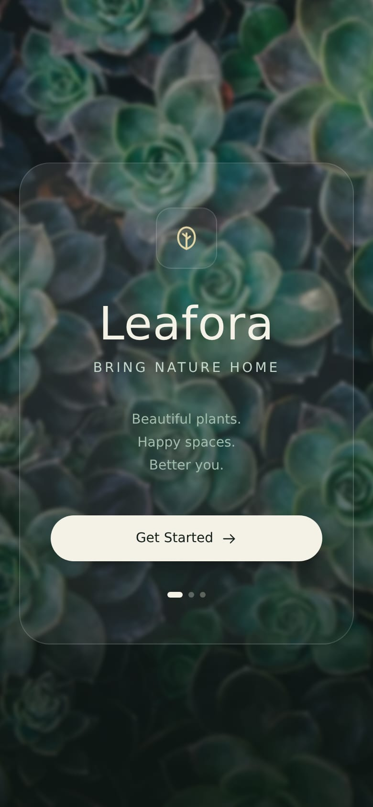
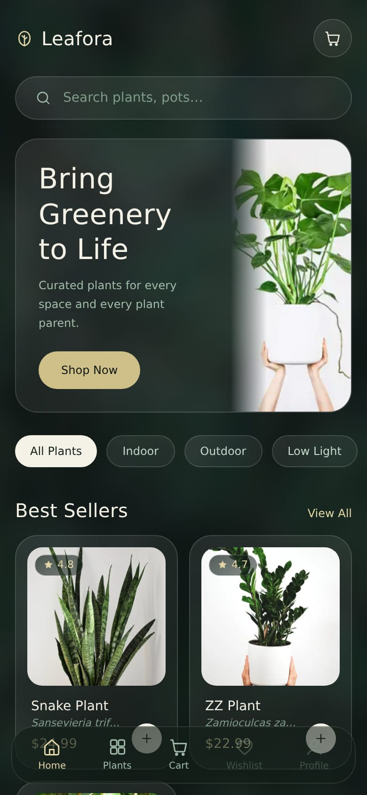
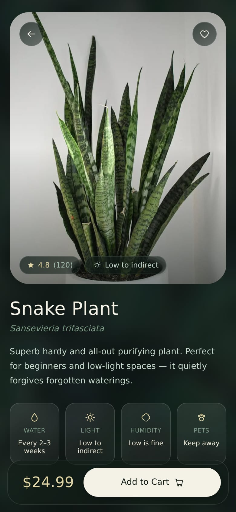
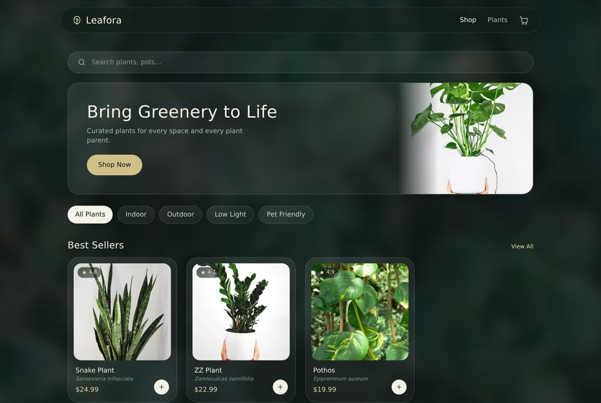
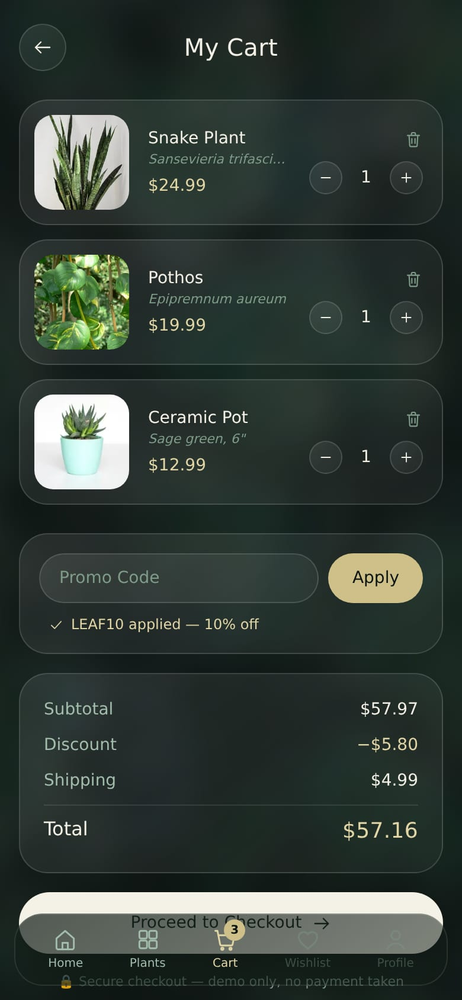

# 🌿 Leafora — Bring Nature Home

A plant-shop e-commerce showcase with a dark forest-green, glassmorphism aesthetic — frosted glass cards over blurred botanical photography, serif display type, and soft gold accents.

**Live demo → [plants-eosin.vercel.app](https://plants-eosin.vercel.app)**

<p align="center">
  
  
  
</p>

## Features

- **Full shopping flow** — onboarding → shop → product detail → cart → mock checkout with an order confirmation. No backend, no payments; everything runs client-side.
- **Live search & category filters** — All Plants, Indoor, Outdoor, Low Light, Pet Friendly, with a staggered re-animation on every filter change.
- **Working cart** — add to cart from anywhere, quantity steppers, remove, and a promo code (`LEAF10` = 10% off). State lives in React context and persists to `localStorage`.
- **Responsive** — bottom tab bar and single-column layout on mobile (faithful to the original app design), top navbar with multi-column layouts on desktop.
- **CSS-only motion** — entrance cascades, a slow Ken Burns drift on the backdrop, floating logo, cart-badge pops. Fully disabled under `prefers-reduced-motion`.

<p align="center">
  
</p>
<p align="center">
  
</p>

## Stack

- [Next.js 15](https://nextjs.org) (App Router, static prerendering for all product pages)
- [React 19](https://react.dev)
- [Tailwind CSS 4](https://tailwindcss.com) (CSS-first config, custom design tokens)
- TypeScript
- Deployed on [Vercel](https://vercel.com)

## Running locally

```bash
npm install
npm run dev
```

Open [http://localhost:3000](http://localhost:3000). Try the promo code **LEAF10** in the cart.

## Project structure

```
app/            pages: onboarding, shop, plant/[slug], cart, checkout
components/     glass cards, pill buttons, navs, product card, icons
lib/            product catalog + cart context (localStorage-persisted)
public/plants/  product photography
```

## Credits

- Design recreated from a mobile app concept (reference screenshots kept locally, untracked).
- Plant photography: free images from Unsplash, Wikimedia Commons, and Flickr (CC-licensed).

---

*Demo project — no real orders, payments, or plants were harmed.* 🌱
